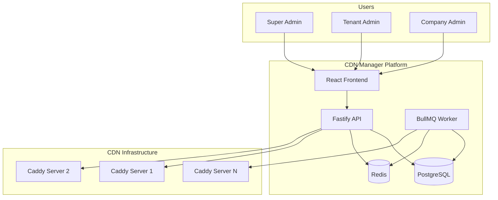
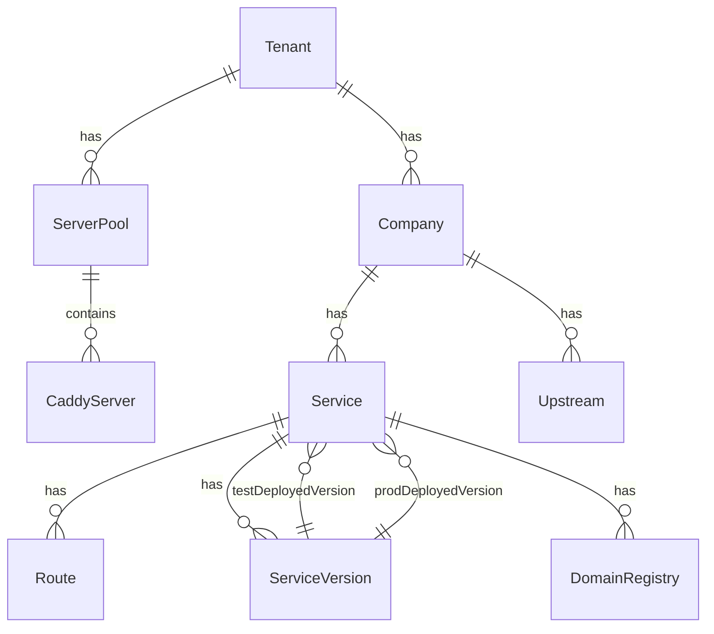
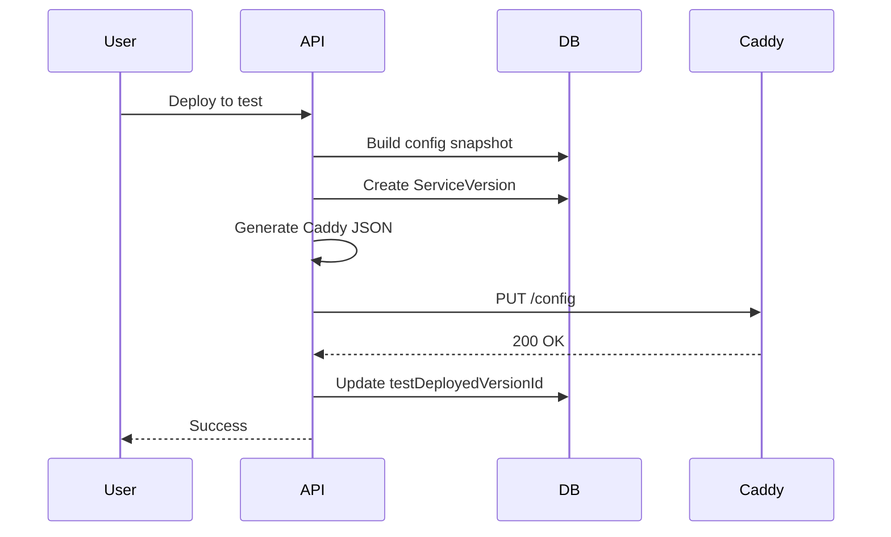

# Architecture

CDN Manager is built as a modular monolith with background job processing, designed for multi-tenancy and horizontal scalability.

## System overview



## Components

### Backend API

**Technology**: Node.js 20, Fastify 4, Prisma

The API server handles all HTTP requests and WebSocket connections.

**Key modules**:
- `modules/auth` - JWT authentication and authorization
- `modules/tenants` - Tenant management
- `modules/companies` - Company management
- `modules/services` - CDN service configuration
- `modules/deployments` - Deployment orchestration
- `modules/domain-registry` - Domain source of truth

**Path aliases**:
```typescript
@/*        → src/*
@modules/* → src/modules/*
@common/*  → src/common/*
@jobs/*    → src/jobs/*
```

### Frontend

**Technology**: React 18, Vite, Tailwind CSS, TanStack Query

Single-page application with role-based routing.

**Structure**:
- `pages/admin/` - Super admin pages
- `pages/tenant/` - Tenant admin pages
- `pages/company/` - Company admin pages

### Background worker

**Technology**: BullMQ, Redis

Processes async jobs for:
- Server heartbeat monitoring
- Bandwidth aggregation
- Caddy installation
- Certificate checks
- Domain health checks
- Quota enforcement
- Alert notifications

### PostgreSQL

Primary data store with:
- Row-level tenant isolation
- Audit logging
- Time-series metrics
- Partitioned logs table

### Redis

Used for:
- Job queue (BullMQ)
- Pub/sub (WebSocket broadcasting)
- Cache (session data)

## Key patterns

### Multi-tenancy isolation

All data is isolated by `tenantId`:

```typescript
// Middleware extracts tenant from JWT
const tenant = await prisma.tenant.findUnique({
  where: { id: user.tenantId }
});

// All queries are scoped
const services = await prisma.service.findMany({
  where: { 
    company: { tenantId: user.tenantId }
  }
});
```

### Immutable deployment snapshots

Each deployment creates an immutable `ServiceVersion`:

```typescript
interface ServiceVersion {
  id: string;
  serviceId: string;
  version: number;
  configSnapshot: ConfigSnapshot; // Frozen at deploy time
  changeSummary: string;
  createdAt: Date;
}
```

**Why snapshots?**
- Enables rollback to previous versions
- Change detection between versions
- Prevents accidental config drift
- Audit trail of all changes

### Domain registry pattern

The `DomainRegistry` table is the single source of truth for domains:

```typescript
interface DomainRegistry {
  domain: string;
  serviceId: string;
  domainType: 'production' | 'test';
  
  // Per-domain SSL
  sslMode: 'auto' | 'custom' | 'disabled' | 'default';
  certificateId?: string;
  
  // Deployment state
  deployedToTest: boolean;
  deployedToProd: boolean;
  
  // Caddy state per server
  caddyState: {
    [serverId: string]: {
      inSkipList: boolean;
      inTlsSubjects: boolean;
      routeDeployed: boolean;
    }
  };
}
```

**LIVE domain operations**:
- Add/remove domains without full redeployment
- Only updates domain-related Caddy config
- Prevents pushing untested service changes

### Deployment features plugin

Modular deployment operations via plugin architecture:

```typescript
interface DeploymentFeature {
  name: string;
  order: number;
  stateKey?: keyof CaddyDomainState;
  
  buildFullConfig?(services, context): DeploymentConfigFragment;
  applyToServer?(client, options): Promise<FeatureResult>;
  cleanupFromServer?(client, options): Promise<FeatureResult>;
}
```

**Registered features**:
1. TLS config (global settings)
2. TLS subjects (certificate automation)
3. Skip list (disabled SSL domains)
4. Logger names (per-domain logging)
5. Redirect routes (HTTP→HTTPS)
6. Service routes (main traffic)

### Cascading changes

When shared resources change, affected services auto-deploy to test:

```typescript
// Update upstream
await upstreamService.update(id, data);

// Cascade to affected services
const result = await cascadingChangeService.handleUpstreamUpdate(
  oldUpstream,
  newUpstream
);

// Returns: { servicesAffected: 3, deployments: [...] }
```

**Tracked resources**:
- Upstreams
- JWT profiles
- Forward auth profiles

## Data architecture

### Entity relationships



### Key tables

| Table | Purpose |
|-------|---------|
| `tenants` | Multi-tenant organizations |
| `companies` | Tenant's customers |
| `services` | CDN services |
| `routes` | URL routing rules |
| `upstreams` | Backend servers |
| `domain_registry` | Domain source of truth |
| `service_versions` | Immutable deployment snapshots |
| `caddy_servers` | Managed Caddy instances |
| `server_pools` | Server groupings (test/prod) |

## Security

### Authentication

JWT-based with refresh token rotation:

```typescript
// Login
POST /v1/auth/login
{ email, password }
→ { accessToken, refreshToken }

// Refresh
POST /v1/auth/refresh
{ refreshToken }
→ { accessToken, refreshToken }
```

**Token storage**:
- Access token: Memory (short-lived, 15 min)
- Refresh token: localStorage (long-lived, 7 days)

### Authorization

Three-level authorization:

1. **Route level** - Fastify hook checks role
2. **Resource level** - Service verifies tenant/company ownership
3. **Field level** - Zod schema validates request structure

### Data protection

| Data | Protection |
|------|------------|
| Passwords | bcrypt (cost 12) |
| SSH keys | AES-256-GCM |
| API keys | SHA-256 hash |
| Certificates | Encrypted at rest |

## Deployment

### Server pool types

| Pool type | Purpose | Domains |
|-----------|---------|---------|
| Test | Pre-production | Auto-generated test domains |
| Production | Live traffic | Custom production domains |

**Key principle**: Test and production are completely isolated. Changes to production domains never affect test deployments.

### Deployment flow



### Resync operation

Resync pushes the currently deployed config to servers:

**Use cases**:
- Server restart recovery
- New server added to pool
- Manual re-deployment

**Important**: Resync uses:
- **Snapshot** for service config (routes, handlers)
- **Domain Registry** for domains (filtered by deployed flags)

## Scalability

### Horizontal scaling

| Component | Strategy |
|-----------|----------|
| API | Stateless, add more instances |
| Worker | Queue-based, add more workers |
| PostgreSQL | Read replicas for queries |
| Redis | Cluster mode |

### Performance targets

| Metric | Target |
|--------|--------|
| API latency (p95) | < 200ms |
| Deployment time | < 10s per service |
| WebSocket latency | < 100ms |

## Monitoring

### Health checks

```bash
# Basic health
GET /health
→ { status: "ok", version: "2.0.0" }

# Detailed health
GET /health/detailed
→ { 
  status: "ok",
  database: "connected",
  redis: "connected",
  workers: { active: 3 }
}
```

### Metrics

Background workers collect:
- Server CPU/memory usage
- Request counts and latency
- Bandwidth usage
- Certificate expiry
- Domain health

## Technology stack

| Layer | Technology |
|-------|------------|
| Frontend | React 18, Vite, Tailwind CSS |
| Backend | Node.js 20, Fastify 4 |
| ORM | Prisma |
| Database | PostgreSQL 15 |
| Cache/Queue | Redis 7 |
| Jobs | BullMQ |
| CDN | Caddy Server 2 |
| Validation | Zod |
| Logging | Pino |

## Design decisions

Key architecture decisions are documented in ADRs:

- [ADR-0001: Multi-tenancy](/cdn_manager/adr/multi-tenancy)
- [ADR-0002: Deployment strategy](/cdn_manager/adr/deployment-strategy)
- [ADR-0003: Domain registry](/cdn_manager/adr/domain-registry)
- [ADR-0004: Config snapshots](/cdn_manager/adr/config-snapshots)
- [ADR-0005: Background jobs](/cdn_manager/adr/background-jobs)
- [ADR-0006: Cascading changes](/cdn_manager/adr/cascading-changes)
- [ADR-0007: Deployment features](/cdn_manager/adr/deployment-features)
